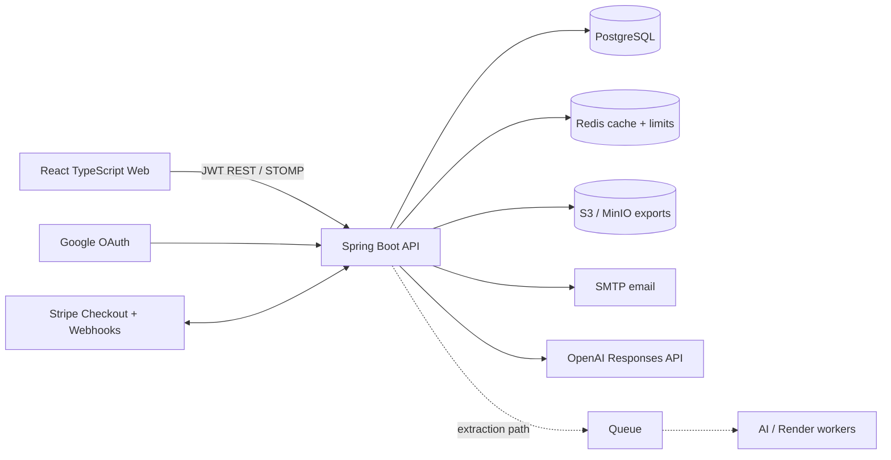
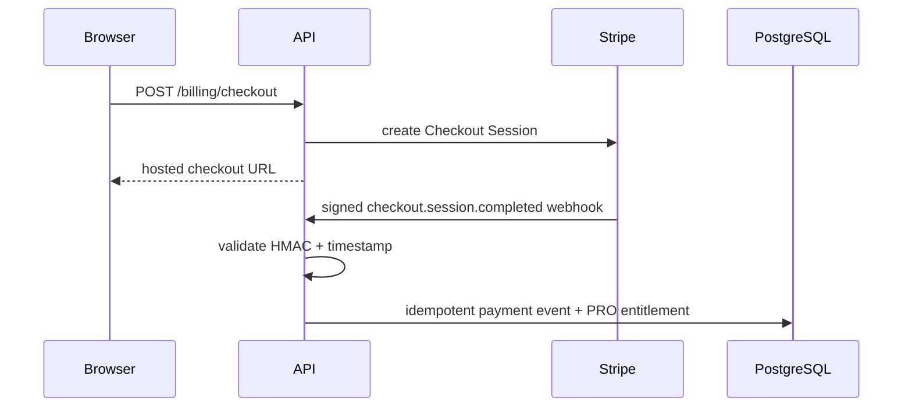
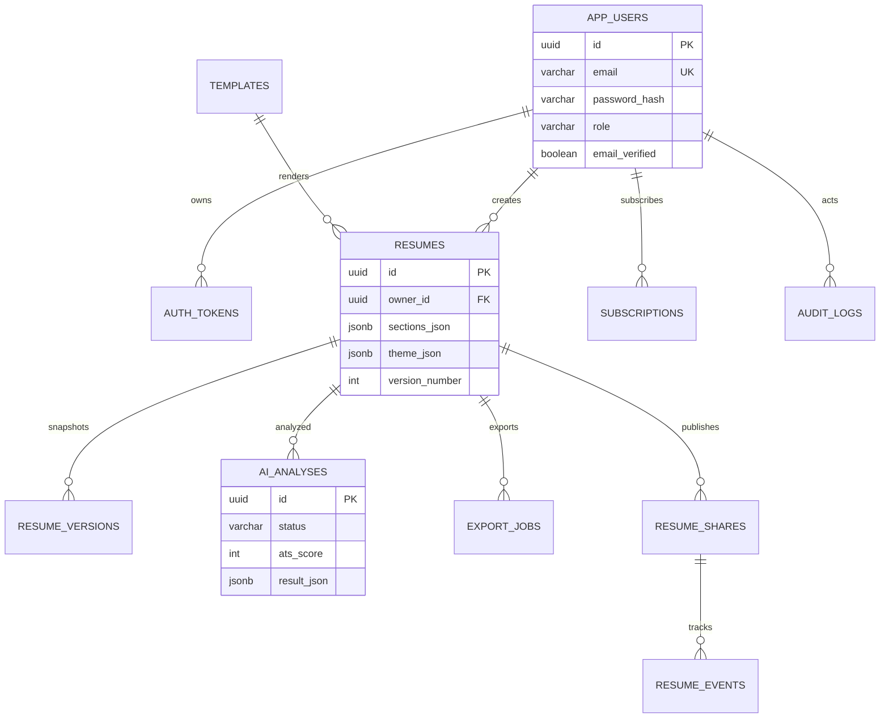

# ATSForge Architecture

## Product Boundary

ATSForge is delivered as a modular monolith: one Spring Boot deployable with domain-separated packages and one React client. This is the appropriate initial SaaS shape because resume saves, entitlement checks, exports and audit records need reliable transactions, while deployment and incident response remain simple for a startup team.

The expensive or independently scalable work already has job boundaries (`ai_analyses`, `export_jobs`, object storage). When volume warrants it, AI analysis and PDF rendering can move to queue consumers without changing the public API or core relational model.

## Components



## Backend Modules

| Package | Responsibility | Scaling boundary |
| --- | --- | --- |
| `auth`, `security`, `user` | JWT, rotating refresh tokens, verified identity, OAuth exchange, RBAC and throttling | Keep in API; external IdP is optional later |
| `resume`, `template` | Authoring aggregate, ordered JSON sections, themes, templates, immutable versions | Transactional core |
| `ai` | Durable analysis request, structured provider adapter, quota, local fallback | Move processor to queue worker |
| `export`, `storage` | Multi-format render, delivery quota, archival | Move PDF/DOCX jobs to worker |
| `analytics` | Public share tokens, anonymized view/click events, QR code | Event stream/warehouse later |
| `billing` | Stripe checkout, signed idempotent webhooks, entitlements | Keep webhook authority centralized |
| `admin`, `common` | operational metrics, audit visibility, API errors | Read replica/warehouse later |

### Why JSON Sections

`resumes.sections_json` stores ordered blocks and custom section content as `jsonb`; it makes custom authoring and template rendering extensible without adding a table for every new block type. Ownership, title, template, state and timestamps remain relational for authorization and fast listings. Immutable snapshots in `resume_versions` make restores and compliance review straightforward.

Tradeoff: querying individual experience bullets is less convenient. PostgreSQL GIN indexes enable coarse content searching; a later normalized/search-index projection can support marketplace analytics or semantic search without constraining the editing document.

## Core Data Flow

### Authoring And Export

```mermaid
sequenceDiagram
  participant U as Browser
  participant A as API
  participant DB as PostgreSQL
  participant WS as WebSocket
  participant S as S3 Storage
  U->>A: PUT /resumes/{id}/autosave (JWT)
  A->>DB: validate owner; update JSON document
  A-->>WS: SAVED notification
  A-->>U: updated resume
  U->>A: GET /resumes/{id}/export?format=pdf
  A->>DB: verify entitlement; insert export_job
  A->>A: render HTML -> PDF
  A->>S: archive immutable artifact
  A-->>U: file download
```

### AI Analysis

```mermaid
sequenceDiagram
  participant U as Browser
  participant A as API
  participant DB as PostgreSQL
  participant J as Async Processor
  participant AI as OpenAI Responses API
  U->>A: POST /resumes/{id}/analyses + job description
  A->>DB: check allowance; store QUEUED job
  A-->>U: 202 + analysis id
  A->>J: dispatch analysis id
  J->>AI: structured ATS analysis request
  AI-->>J: score and recommendations JSON
  J->>DB: COMPLETED, result and token usage
  U->>A: GET /analyses/{id}
  A-->>U: result
```

The current processor uses Spring async execution. In horizontally scaled production, replace dispatch with RabbitMQ, SQS or Kafka and retain this durable job contract, idempotency and polling API.

### Subscription Upgrade



## Entity Relationship Model



The source-of-truth schema and initial template seed data are in `backend/src/main/resources/db/migration/V1__core_schema.sql`.

## Index Strategy

| Index | Workload |
| --- | --- |
| unique `app_users(email)` | login, OAuth account linking |
| `auth_tokens(user_id, token_type, expires_at)` plus unique hash | token rotation/revocation without raw token storage |
| `resumes(owner_id, updated_at DESC)` | workspace pagination |
| GIN `resumes(sections_json)` | content/filter evolution |
| unique `resume_versions(resume_id, version_number)` | concurrency-safe history |
| `resume_events(resume_id, occurred_at DESC)` | analytics windows |
| `ai_analyses(requested_by, created_at DESC)` | allowances and usage reporting |
| unique `payment_events(stripe_event_id)` | webhook replay protection |

For large installations, partition `resume_events`, `audit_logs` and `payment_events` by month, roll analytics into aggregates, and route admin reporting to replicas or a warehouse.

## Library Selections And Tradeoffs

| Need | Choice | Rationale / tradeoff |
| --- | --- | --- |
| API/security | Spring MVC, Security, JJWT | Mature policy control; opaque refresh tokens allow revocation. JWT access tokens are intentionally short-lived. |
| Database migration | Flyway + PostgreSQL | Reviewed, deterministic schema rollout; PostgreSQL `jsonb` is valuable for builder documents. |
| Limits/cache | Spring Redis | Shared limits across API replicas; requests fail open on Redis incident, requiring gateway/WAF limits as first line. |
| API docs | Springdoc OpenAPI | Generates contract from actual endpoints; pin version with Boot compatibility. |
| PDF | OpenHTMLtoPDF | Runs in-process and is container-friendly; complex designer templates may later use isolated Chromium workers. |
| DOCX | Apache POI | Native document output; elaborate layout parity with HTML requires template-specific work. |
| Files | AWS SDK S3 | Compatible with AWS S3, GCS interoperability layers and local MinIO. |
| Billing | Stripe hosted Checkout + signed webhooks | Removes card handling from this system and reduces PCI scope. |
| AI | OpenAI Responses API via isolated REST adapter | Structured JSON responses and no SDK lock-in; model is configured by environment and needs evaluation before change. |

OpenAI implementation references the official [Responses API guide](https://developers.openai.com/api/docs/guides/responses) and [Structured Outputs guide](https://developers.openai.com/api/docs/guides/structured-outputs).

## Extraction And Scaling

1. Run multiple stateless API containers behind an ingress; use PostgreSQL, Redis and object storage as managed services.
2. Introduce a queue when AI/PDF latency or retries affect request threads. Workers consume durable job IDs and update the existing status records.
3. Store generated artifacts with retention policies and pre-signed downloads rather than transmitting repeatedly through the API.
4. Add CDN caching for public resume HTML after access controls are fully modeled.
5. Create vector embeddings for resume/job skill chunks only after consent, retention and deletion requirements are defined.
6. Add OpenTelemetry traces and Prometheus alerting around authentication failures, webhook rejection, job age, provider cost and export latency.

